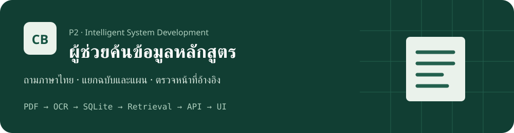
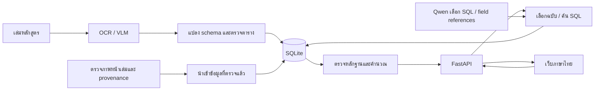
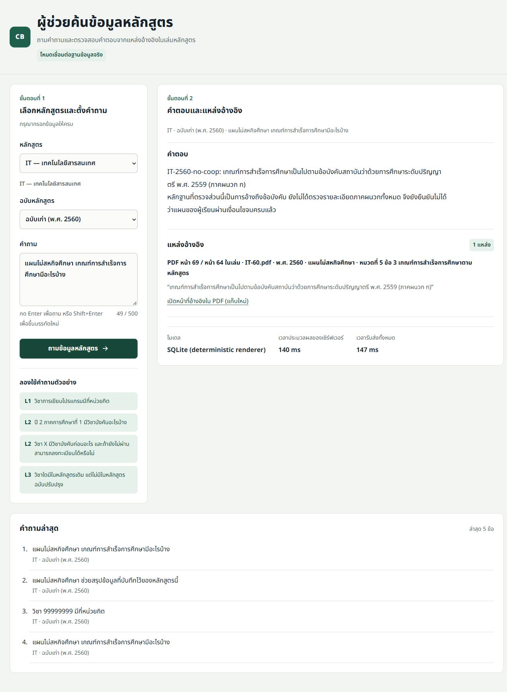

<div align="center">
  
  <h1>ผู้ช่วยค้นข้อมูลหลักสูตร</h1>
  <p>โครงงาน P2 · Intelligent System Development · isd-2026-cooltone</p>
  <p>ถามภาษาไทย · เลือกฉบับและแผนการเรียน · ตรวจหน้าหนังสือที่รองรับคำตอบ</p>
  
</div>

โครงงาน **P2: OCR เล่มหลักสูตร เพื่อตอบคำถามเกี่ยวกับการเรียน** เริ่มจาก DSBA และขยายสู่ AI, IT และ BIT ข้อเท็จจริงขณะตอบมาจาก SQLite ไม่ใช้เฉลย evaluation เติมคำตอบ คู่มือนี้สำหรับอาจารย์ที่เริ่มจาก checkout ใหม่หรือเปิดเครื่องใหม่ โดยไม่ต้องรู้โครงสร้างโฟลเดอร์เดิม

| สิ่งที่ต้องรู้ก่อนเริ่ม | ตำแหน่ง / วิธีใช้ |
|---|---|
| แอปปัจจุบัน | เข้า `ocr_final/` ก่อนรันคำสั่ง Python และ PowerShell |
| เปิดเว็บ | `scripts/start_web.ps1` เปิด FastAPI และ frontend ในบริการเดียว |
| URL | **http://127.0.0.1:8000/frontend/** ใช้ `http` ไม่ใช่ `https` |
| ข้อมูลที่ต้องรับแยก | source PDFs และ runtime DB bundle ไม่รวมใน Git; clone โค้ดอย่างเดียวยังตอบไม่ได้ |
| ใช้ครั้งแรก / ใช้ประจำ | [ติดตั้งครั้งแรก](#ติดตั้งครั้งแรก) / [เปิดใช้งานหลังเปิดคอมหรือรีสตาร์ต](#เปิดใช้งานหลังเปิดคอมหรือรีสตาร์ต) |

> สถานะล่าสุด: มีการทดสอบแอปจริงและ regression แต่ **ยังไม่ได้ยืนยันความถูกต้องของหนังสือทั้งเล่มหรือทุกคำถาม** การไม่พบข้อมูลใน DB ไม่ใช่หลักฐานว่าไม่มีในหลักสูตร ไม่รับรองการลงทะเบียน การจบ หรือการเปิดรายวิชาแทนสถาบัน

## สารบัญ

- [ขอบเขตและทีม](#ขอบเขตและทีม)
- [โครงสร้างระบบ](#โครงสร้างระบบ)
- [ไฟล์สำคัญและโฟลเดอร์ที่ใช้](#ไฟล์สำคัญและโฟลเดอร์ที่ใช้)
- [ติดตั้งครั้งแรก](#ติดตั้งครั้งแรก)
- [เตรียมข้อมูลและฐานข้อมูล](#เตรียมข้อมูลและฐานข้อมูล)
- [เปิดใช้งานหลังเปิดคอมหรือรีสตาร์ต](#เปิดใช้งานหลังเปิดคอมหรือรีสตาร์ต)
- [ถามคำถามและอ่านแหล่งอ้างอิง](#ถามคำถามและอ่านแหล่งอ้างอิง)
- [การประเมินและข้อจำกัด](#การประเมินและข้อจำกัด)
- [แก้ปัญหาที่เคยพบ](#แก้ปัญหาที่เคยพบ)
- [แหล่งข้อมูลและการส่งต่องาน](#แหล่งข้อมูลและการส่งต่องาน)

## ขอบเขตและทีม

| หลักสูตร | ฉบับที่ตรวจตัวตนจากภาพปก | แผนใน UI | ต้นฉบับที่ต้องจัดเตรียม |
|---|---|---|---|
| AI / AIT | 2566 | สหกิจศึกษา | `AI.pdf` |
| DSBA | 2565 และ 2560 | สหกิจศึกษา / ไม่สหกิจศึกษา | `DSBA.pdf`, `DSBA-60.pdf` |
| IT | 2565 และ 2560 | สหกิจศึกษา / ไม่สหกิจศึกษา | `IT.pdf`, `IT-60.pdf` |
| BIT | 2565 และ 2560 (นานาชาติ) | สหกิจศึกษา / ไม่สหกิจศึกษา | `BIT-65.pdf`, `BIT-60.pdf` |
| legacy | ตัวตนและฉบับยังไม่ครบ | API เท่านั้น ไม่มีตัวเลือกใน UI | catalog เดิม ไม่ใช่หลักสูตรที่ยืนยันเพิ่ม |

มี 13 profile ที่เลือกผ่าน UI และ legacy อีก 1 catalog ปีของ AI คือ **2566** ตามผลตรวจปก ไม่สมมติว่าเป็น 2565 ตามชื่อไฟล์ ไม่มีต้นฉบับ AI รุ่นเก่า, revision ต่างกันในปีเดียวกัน หรือสองปริญญาที่ตรวจยืนยันแล้ว

สมาชิกตามข้อมูลเดิมใน repository (ยังไม่มีชื่อจริงที่ยืนยัน):

| รหัสนักศึกษา | ชื่อใน Discord |
|---|---|
| 67070068 | pleum |
| 67070257 | plattyr.pus |
| 67070289 | nongingfah |

## โครงสร้างระบบ



| ขั้นตอน | สิ่งที่ใช้จริง | จุดสำคัญ |
|---|---|---|
| อ่านเอกสาร | PyMuPDF, pdfplumber, EasyOCR และ VLM `scb10x/typhoon-ocr1.5-3b:latest` | embedded Thai บางเล่มเสียจาก font ต้องตรวจภาพ ไม่ใช้ OCR เป็น GT อิสระ |
| แปลงและจัดเก็บ | Pydantic, SQLite, `scr/ocr_system/lab8b_curriculum_db.py` | แยก elective slots, alternatives, แผน, PDF page และ printed page |
| ค้นและตอบ | `qwen3:4b` ผ่าน Ollama + SQL validator + deterministic renderer | คำถามที่รู้รูปแบบใช้ SQLite โดยตรง; unknown intent ให้ LLM เลือกหลักฐานที่ตรวจได้ ไม่ปล่อยข้อความข้อเท็จจริงอิสระ |
| เว็บ | FastAPI, HTML/CSS/JavaScript เดิม, Noto Sans Thai | same-origin, ไม่มี mock ในเส้นทางใช้งานจริง, แสดงชื่อ engine ตามที่ใช้ |

ไม่มี vector index ที่ต้องสร้างทุกครั้ง เปิด DB ที่มีอยู่ได้เลย ข้อมูล source review ใช้ตอน ingestion ไม่ใช่ overlay ที่เปลี่ยนข้อเท็จจริงหลัง SQL ส่วน evaluation/debug/held-out แยกจากข้อมูลสำหรับตอบ

โค้ดแอปอยู่ใน **`ocr_final/`** ไม่ใช่ `ocr_system/` เดิมที่ root รายงาน Lab07 และเอกสารเดิมยังเก็บไว้

## ไฟล์สำคัญและโฟลเดอร์ที่ใช้

```text
isd-2026-cooltone/
├── README.md                         คู่มือหลักที่ GitHub แสดงบนหน้า repository
├── AGENTS.md                         กติกาการทำงานและ checkpoint
├── docs/
│   ├── PROGRESS.md                   checkpoint เดียว
│   ├── assets/                       banner และ badges ของโครงการ
│   ├── public_results/               หลักฐานสำหรับเผยแพร่ที่ตัด local paths แล้ว
│   └── results/                      raw evidence ในเครื่อง ไม่เผยแพร่ชุดใหม่
├── ocr_final/                        แอปปัจจุบัน — รันคำสั่งจากที่นี่
│   ├── requirements-web-tested.txt   dependencies สำหรับเปิดเว็บ
│   ├── requirements-dev.txt          dependencies เพิ่มสำหรับ OCR/ทดสอบ
│   ├── lab10_fastapi/curriculum_app/ backend และ .env.example
│   ├── frontend/                     เว็บภาษาไทยและ API contract
│   ├── scr/ocr_system/               OCR/parser/SQLite pipeline ปัจจุบัน
│   ├── scripts/                      เปิด/หยุด/preflight/ingest/evaluation
│   ├── tests/                        regression และ gold cases
│   ├── data/input/                   source PDFs ที่รับแยกจาก Git
│   ├── data/source_reviews/          facts/citations ที่ตรวจจากภาพก่อน ingest
│   ├── data/ground_truth/            labels และ approvals แยกตาม provenance
│   ├── work/                         DB แยก profile, logs และ backups
│   ├── curriculum.db                 legacy catalog ที่รับแยก
│   └── Lab09_report.md               รายงาน evaluation เดิม
└── ocr_system/                       งานรุ่นเดิม ไม่ใช่แอปที่คู่มือนี้เปิด
```

| ตำแหน่ง | ใช้ทำอะไร | ต้องใช้เมื่อใด |
|---|---|---|
| `README.md` ที่ root | คู่มือเริ่มต้นทั้งโครงการ; GitHub homepage ใช้ไฟล์นี้ของ branch ที่เปิด | ติดตั้ง/เปิดใช้งาน/ส่งต่องาน |
| `ocr_final/scripts/start_web.ps1`, `stop_web.ps1` | เริ่ม backend แบบ background และหยุดเฉพาะ process ที่ตรวจ ownership แล้ว | เปิด/หยุดเว็บ ไม่ต้องเปิด frontend server แยก |
| `ocr_final/scripts/check_setup.py` | ตรวจ runtime packages, model readiness, DB profiles, PDFs/source hashes | หลังเตรียมข้อมูลและก่อนเริ่มบริการ |
| `ocr_final/requirements-web-tested.txt`, `requirements.txt`, `requirements-dev.txt` | แยก runtime เว็บจากชุด OCR/audit/tests | ติดตั้งครั้งแรก หรือเพิ่มงาน OCR/ทดสอบ |
| `ocr_final/lab10_fastapi/curriculum_app/.env.example` | ตัวอย่าง configuration แบบไม่มี secret | สร้าง `.env` ครั้งแรกเท่านั้น |
| `ocr_final/data/input/`, `ocr_final/work/lab8b_*/curriculum.db` | หนังสือและฐานข้อมูลแต่ละปี/แผน | ต้องจัดเตรียมก่อนถาม; ไม่ rebuild ทุกครั้ง |
| `ocr_final/data/source_reviews/`, `data/ground_truth/` | production source review และ evaluation/approval ที่ต้องแยกบทบาท | ingest หรือประเมิน ไม่โหลดเฉลยไปตอบ |
| `ocr_final/tests/`, `scripts/run_qa_gold.py`, `reports/` | ตรวจ regression/คำตอบ/coverage | หลังแก้ pipeline และก่อนส่งผล |
| `docs/public_results/`, `docs/PROGRESS.md` | ผลดิบ/ข้อจำกัด และสถานะงานเดียว | ตรวจหลักฐานหรือทำงานต่อ |
| `ocr_system/README.md`, `ocr_final/frontend/README.md` | คู่มือรุ่นเก่า / contract ของ UI ตามลำดับ | อ้างประวัติหรือพัฒนา UI; ไม่ใช่คู่มือเริ่มระบบทั้งโครงการ |

`scr/` เป็นชื่อจริงของโฟลเดอร์ในโครงการนี้ ไม่ใช่ `src/` ตัว live application ของผู้พัฒนาอาจอยู่อีกโฟลเดอร์ แต่ผู้รับงานใช้ `ocr_final/` ใน checkout นี้ได้ ไม่ต้องมีตำแหน่งส่วนตัวของผู้พัฒนา

## ติดตั้งครั้งแรก

ทดสอบบน Windows 11, PowerShell 7.6.5 และ Python 3.11.9 เครื่องที่ตรวจใช้ RAM 15.7 GiB, Intel i7-13620H และ RTX 5050 Laptop GPU นี่เป็นสภาพแวดล้อมที่ใช้วัด ไม่ใช่สเปกขั้นต่ำที่รับรอง Windows PowerShell 5.1, Linux/macOS และเครื่องไม่มี GPU ยังไม่ได้ทดสอบ ระยะเวลา OCR ขึ้นกับเครื่อง

ทำตามลำดับต่อไปนี้ ใช้ **PowerShell** ทุก code block ในคู่มือนี้ ไม่ต้องเปิดบริการจาก `ocr_system/` เดิม

### 1. เตรียมโปรแกรม

ต้องมี Python 3.11, Git และ Ollama สำหรับ Windows สำหรับ frontend tests เท่านั้นต้องมี Node.js (เปิดเว็บไม่ใช้ Node) ตรวจด้วย `py -3.11 --version`, `git --version`, `ollama --version` หากไม่พบคำสั่งให้ติดตั้งโปรแกรมนั้นและเปิด PowerShell ใหม่ เวอร์ชันที่ใช้ทดสอบ Python3.11.9/Ollama0.35.1; ไม่รับรองทุกเวอร์ชันหรือสเปกขั้นต่ำ การดาวน์โหลดโมเดลครั้งแรกและเวลาติดตั้งทั้งหมดบนเครื่องใหม่ยังไม่วัด

### 2. รับ repository แล้วเข้าโฟลเดอร์แอป

จากโฟลเดอร์ที่ต้องการเก็บงาน:

```powershell
git clone --branch week11_thanapat https://github.com/thanapat6954/isd-2026-cooltone.git
Set-Location -LiteralPath '.\isd-2026-cooltone\ocr_final'
```

**เลือก branch ให้ถูก:** คู่มือนี้ใช้ `week11_thanapat` ไม่ใช่ `main` คำสั่ง clone ข้างต้นเลือก branch นี้โดยตรง หลังรับโค้ดแล้วยังต้องเตรียม PDFs และ runtime DB bundle ตามข้อ7 ไม่ถือว่าการ clone เพียงอย่างเดียวทำให้ตอบคำถามได้

### 3. สร้าง environment

```powershell
py -3.11 -m venv venv
```

เกิด `venv/Scripts/python.exe` สำหรับแอปโดยเฉพาะ เพื่อไม่ปะปน packages กับ Python ของงานอื่น หาก `py` หา3.11ไม่พบ ให้ตรวจการติดตั้ง Python ก่อน ไม่รัน Python คนละเวอร์ชันโดยเดา

### 4. ติดตั้ง dependencies สำหรับเปิดเว็บ

จาก `ocr_final/`:

```powershell
.\venv\Scripts\python.exe -m pip install -r requirements-web-tested.txt
```

คำสั่งข้างต้นติดตั้งเฉพาะเว็บด้วย direct dependency versions ที่ทดสอบใน environment ใหม่ ดู [transitive versions ที่ติดตั้งจริง](docs/public_results/week11/isolated_runtime_versions.txt) ไม่ต้อง activate venv เพื่อใช้คำสั่งในเอกสารนี้ หากต้องทำ OCR/audit/ชุดทดสอบทั้งหมดเพิ่ม:

```powershell
.\venv\Scripts\python.exe -m pip install -r requirements-dev.txt
```

`requirements.txt` มี pdfplumber, pythainlp และ dependencies สำหรับ OCR; การติดตั้งชุด OCR ทั้งหมดใน environment ใหม่ยังไม่ได้ตรวจครั้งนี้ `requirements-dev.txt` เพิ่ม TestClient dependency ตาม [Starlette](https://starlette.dev/testclient/)

หากติดตั้งสำเร็จ pip จะรายงาน packages ที่ติดตั้งหรือ `Requirement already satisfied`; ถ้าเกิด error ต้องแก้ให้สำเร็จก่อนเปิด backend ไม่ต้องใช้ `Activate.ps1` จึงไม่ติดปัญหา execution policy ของการ activate

### 5. ตั้งค่า environment ครั้งแรก

จาก `ocr_final/` คัดลอกตัวอย่างเฉพาะเมื่อยังไม่มี `.env` เพื่อไม่ทับค่าที่ตั้งไว้:

```powershell
$envFile = 'lab10_fastapi/curriculum_app/.env'
if (-not (Test-Path -LiteralPath $envFile)) {
    Copy-Item -LiteralPath 'lab10_fastapi/curriculum_app/.env.example' -Destination $envFile
}
```

| ตัวแปร | ค่าเริ่มต้น | หน้าที่ |
|---|---|---|
| `CURRICULUM_OLLAMA_URL` | `http://127.0.0.1:11434` | ติดต่อบริการโมเดลจาก backend |
| `CURRICULUM_OLLAMA_MODEL` | `qwen3:4b` | โมเดลเลือก SQL/หลักฐานสำหรับ unknown intent |
| `CURRICULUM_DATABASE_ROOT` | `.` | หา DB จาก root ของแอป ไม่ขึ้นกับตำแหน่ง terminal |
| `CURRICULUM_REQUEST_TIMEOUT` | `180` | timeout ของคำขอไปโมเดล ไม่ใช่ SLA ของทุกคำถาม |
| `CURRICULUM_MAX_ROWS` | `100` | จำกัดแถวผล SQL |
| `CURRICULUM_SQL_REPAIR_ATTEMPTS` | `2` | จำกัดการแก้ SQL เมื่อ validator ปฏิเสธ |
| `CURRICULUM_DEBUG` | `false` | ไม่เปิด debug เพิ่มโดยไม่จำเป็น |

### 6. เตรียมโมเดลและเริ่มบริการ

ติดตั้ง [Ollama สำหรับ Windows](https://docs.ollama.com/windows) แล้วตรวจว่าบริการเปิดอยู่ก่อนดาวน์โหลดโมเดล:

```powershell
Invoke-RestMethod http://127.0.0.1:11434/api/tags
```

ถ้าเชื่อมต่อไม่ได้ ให้เปิดแอป Ollama หรือรัน `ollama serve` ใน Terminal1 และคง terminal นั้นไว้ จากนั้นใช้ Terminal2 ดาวน์โหลดโมเดล ถ้า11434ใช้อยู่แล้วไม่เปิดซ้ำ:

```powershell
ollama pull qwen3:4b
ollama list
```

สำหรับ OCR ใหม่เท่านั้น:

```powershell
ollama pull scb10x/typhoon-ocr1.5-3b:latest
```

เครื่องที่ตรวจมี Ollama 0.35.1 และโมเดลทั้งสองแล้ว การดาวน์โหลดครั้งแรกบนเครื่องใหม่ยังไม่ได้ทำซ้ำ ไฟล์โมเดลที่แสดงใน `ollama list` มีประมาณ 2.5 GB และ 3.2 GB ตามลำดับ ต้องเผื่อพื้นที่เพิ่มสำหรับ PDF, OCR และ backups ไม่เก็บโมเดลใน Git

`.env.example` ไม่มี secret ค่าเริ่มต้นใช้ `http://127.0.0.1:11434`, `qwen3:4b` และ `CURRICULUM_DATABASE_ROOT=.` ซึ่งอ้างจากโฟลเดอร์แอป ไม่ใช่ตำแหน่ง terminal ห้ามใส่ key ใน frontend และห้าม commit `.env`

ตรวจ `Invoke-RestMethod http://127.0.0.1:11434/api/tags` อีกครั้งหลังดาวน์โหลด ต้องพบ `qwen3:4b` การติดตั้ง package Python ไม่ได้เปิดบริการนี้แทน

### 7. เตรียม DB และหนังสือ

ทำตาม [เตรียมข้อมูลและฐานข้อมูล](#เตรียมข้อมูลและฐานข้อมูล) ด้านล่าง ต้องมีทั้ง source PDFs และ runtime bundle ก่อน แล้วรันจาก `ocr_final/`:

```powershell
.\venv\Scripts\python.exe scripts/check_setup.py
```

สำเร็จเมื่อ `ready: true`, `model_installed_and_service_ready: true` และไม่มี missing/changed/invalid files หาก `ready: false` อ่านรายการที่ขาดแล้วแก้ก่อนต่อ ไม่ถือว่า clone หรือการติดตั้ง packages ทำให้ DB พร้อมโดยอัตโนมัติ

### 8. เปิด backend และ frontend

จาก `ocr_final/` ใน Terminal2:

```powershell
.\scripts\start_web.ps1
```

ควรเห็น `Backend ready:` หรือ `Backend already running, database and configured model ready:` พร้อม URL ตัว script หา app root จากตำแหน่งตัวเอง ใช้ Python ใน `venv/` เปิด Uvicorn แบบ background เก็บ logs ใน `work/web/` และตรวจ root/DB/model ไม่ reinstall/rebuild/แก้ DB/ฆ่า process อื่น ไม่ต้องเปิด Live Server หรือพอร์ต5500แยก เมื่อ script คืน prompt ปิด Terminal2ได้โดย backend ยังทำงาน

### 9. เปิดเบราว์เซอร์

เข้า **http://127.0.0.1:8000/frontend/** รอหน้าเว็บภาษาไทยพร้อมเลือกหลักสูตร ถ้าเปิดไม่ได้ ตรวจ `/api/health` และ logs ตาม [แก้ปัญหาที่เคยพบ](#แก้ปัญหาที่เคยพบ) ก่อนเริ่ม server อีกตัว

### 10. ถามและตรวจหลักฐาน

เลือก IT → ฉบับเก่า(2560) แล้วถาม “แผนไม่สหกิจศึกษา หลักสูตรนี้มีกี่ปี” ชุดข้อมูลที่ตรวจล่าสุดตอบ4ปี พร้อม IT-60.pdf PDF6/หน้า1ในเล่ม ดู [หลักฐาน metadata](docs/public_results/week11_continuation/REPORT.md) เปิด link เพื่อเทียบต้นฉบับ หากไม่พร้อมหรือคำตอบไม่มีหลักฐาน อย่าใช้ผลนั้นยืนยันสิทธิ์ลงทะเบียน/จบ ดูตัวอย่างเพิ่มเติมใน [ถามคำถามและอ่านแหล่งอ้างอิง](#ถามคำถามและอ่านแหล่งอ้างอิง)

## เตรียมข้อมูลและฐานข้อมูล

**source PDFs และ `curriculum.db` ไม่อยู่ใน repository** การ clone โค้ดอย่างเดียวจึงยังตอบไม่ได้ ต้องจัดเตรียมต้นฉบับทั้ง 7 ไฟล์ใน `ocr_final/data/input/` และ DB artifacts ที่ตรงกัน ไม่มีการสร้างคำตอบสมมติเมื่อข้อมูลขาด

### ใช้ runtime artifacts ที่มีอยู่

รับ runtime bundle ที่ทีมจัดเตรียมให้แยกจาก Git พร้อม `manifest.json` ซึ่งบันทึก profile, SHA256 และ source hashes ตัว bundle เป็น snapshot ของข้อมูลแอปที่ตรวจแล้วบางส่วน **ไม่ใช่ ground truth อิสระหรือหลักฐานว่าข้อมูลทั้งหมดถูกต้อง** สร้างจากเครื่องที่มี DB แล้วได้ด้วย:

```powershell
# Run from ocr_final; choose a new output directory.
.\venv\Scripts\python.exe scripts/runtime_bundle.py export --app-root . --output work/handoff/runtime-data
```

บน checkout ใหม่ วาง bundle ใน `work/handoff/runtime-data/` แล้ว:

```powershell
.\venv\Scripts\python.exe scripts/runtime_bundle.py restore --bundle work/handoff/runtime-data --app-root .
.\venv\Scripts\python.exe scripts/check_setup.py
```

restore ตรวจ path, hash และ integrity ก่อนเขียน และ **ไม่ทับ DB ที่มีอยู่** หากมีไฟล์เดิมให้หยุด ตรวจและสำรองก่อน ไม่ลบเพื่อให้คำสั่งผ่าน preflight ตรวจโมเดล, DB ทั้ง 13 profile และต้นฉบับ/ source hashes ที่ source review ใช้ `ready: true` คือพร้อมเปิดแอป ไม่ใช่คะแนน accuracy

DB อยู่ใน `work/lab8b_ai/`, `work/lab8b_{dsba,it,bit}_.../` แยกปีและแผนตาม [inventory](docs/public_results/week11/inventory_final.json) ส่วน legacy คือ `ocr_final/curriculum.db` ไม่รวม archived candidates ใน bundle

### สร้าง OCR/DB ใหม่เมื่อจำเป็น

ใช้ `run_lab8b.py` และ profile/page ranges ที่บันทึกในโค้ด ไม่ใช้เลขหน้าของ DSBA กับเล่มอื่น:

```powershell
.\venv\Scripts\python.exe run_lab8b.py --help
.\venv\Scripts\python.exe scripts/ingest_program_requirements.py --help
.\venv\Scripts\python.exe scripts/upgrade_fidelity_schema.py --help
```

`run_lab8b.py --program <profile>` ทำ OCR/import/verify และ hook ข้อมูล source-reviewed ตาม profile แต่ **fresh rebuild ทุก profile จาก PDF อย่างเดียว ยังไม่ยืนยันว่าทำได้ครบ** โดยเฉพาะ OCR loss และ historical metadata อย่ารันทับ DB ที่ตรวจแล้วเพื่อเปิดเว็บ ต้องสำรองก่อนและทดสอบ staged build; schema-only upgrade ไม่เติมชื่อหรือ prerequisite ที่ยังไม่ตรวจ รายละเอียด [checkpoint](docs/PROGRESS.md) และ [รายงาน](docs/public_results/week11/WEEK11_REPORT.md)

ก่อน migration ใช้ SQLite backup API และ integrity check ไม่ copy DB ที่กำลังมี WAL แบบเดี่ยว ๆ งานล่าสุดเก็บ backups ใน `work/backups/program-requirements/` และ `work/backups/fidelity-schema/` พร้อม manifest ในรายงาน สำหรับเครื่องที่ทำ migration นี้ตรวจ rollback แบบไม่เขียนได้ เช่น:

```powershell
.\venv\Scripts\python.exe scripts/rollback_db_only.py --app-root . --backups ../docs/public_results/week11/requirement_ingest.json --profile IT-2560-coop --output work/verification/rollback-check.json
```

ตรวจ dry run แล้วจึงหยุด backend ก่อน restore ที่ตั้งใจทำจริง (`--apply`); tool เก็บ pre-rollback snapshot และเช็ค target/source/hash ก่อนเขียน ต้องใช้ manifest ของเครื่องและ DB ชุดนั้น ไม่ใช้ absolute paths ที่อยู่ในหลักฐานเครื่องอื่นแทนกัน ยังไม่ได้ rollback live migration นี้จริง

## เปิดใช้งานหลังเปิดคอมหรือรีสตาร์ต

ไม่ต้อง OCR/rebuild/index ใหม่ทุกครั้ง หาก artifacts ยังใช้ได้

### 1. เปิด PowerShell ใหม่

การติดตั้งครั้งแรกต้องเสร็จก่อน ขั้นตอนนี้ไม่ติดตั้ง packages หรือดาวน์โหลดโมเดลซ้ำ หากใช้ Ollama app ที่เริ่มพร้อม Windows ให้ตรวจ service ก่อน ไม่สมมติว่าพร้อม

### 2. เข้าโฟลเดอร์แอป

เปลี่ยนตำแหน่งตัวอย่างต่อไปนี้เป็น checkout ของผู้รับงาน ใช้ quotes และ `-LiteralPath` เพื่อรองรับชื่อที่มีช่องว่าง:

```powershell
$repository = 'D:\Projects\isd-2026-cooltone'
Set-Location -LiteralPath (Join-Path $repository 'ocr_final')
```

ตำแหน่งนี้เป็นตัวอย่าง ไม่ใช่ข้อกำหนดว่าต้องมี drive D

### 3. เลือก Python ของแอป

```powershell
.\venv\Scripts\python.exe --version
```

ต้องแสดง Python ของ environment ที่สร้างไว้ คู่มือนี้ใช้ executable ตรง ไม่จำเป็นต้อง activate ถ้าไม่พบ `venv` ให้กลับไปติดตั้งครั้งแรก ไม่ใช้ Python global แทนโดยไม่ตรวจ dependencies

### 4. ตรวจ/เปิดบริการโมเดลใน Terminal1

```powershell
Invoke-RestMethod http://127.0.0.1:11434/api/tags
```

หากเชื่อมต่อไม่ได้ เปิด Ollama จาก Start menu หรือรัน `ollama serve` ใน terminal นี้แล้วคงไว้ ถ้าตอบได้แล้ว **ไม่รัน server ซ้ำ** ตาม [เอกสาร Ollama](https://docs.ollama.com/cli)

### 5. เปิด Terminal2 แล้วเริ่มแอป

Terminal1 ที่รัน `ollama serve` ต้องคงเปิดอยู่; Terminal2 ใช้ตำแหน่งเดียวกับข้อ2 ไม่ใช้ `cd ocr_final` ซ้ำเมื่ออยู่ในแอปแล้ว:

```powershell
$repository = 'D:\Projects\isd-2026-cooltone'
Set-Location -LiteralPath (Join-Path $repository 'ocr_final')
.\venv\Scripts\python.exe scripts/check_setup.py
.\scripts\start_web.ps1
```

เปิด **[http://127.0.0.1:8000/frontend/](http://127.0.0.1:8000/frontend/)** ไม่ใช้ `https` และสะกด `frontend` ให้ถูก ไม่ต้องเปิด static server อีกตัว พอร์ต 8000 ต้องเป็น backend ของโฟลเดอร์นี้ launcher ตรวจ root, DB และโมเดลที่ตั้งไว้ ถ้าพบ server คนละโฟลเดอร์จะหยุดโดยไม่ฆ่า process อื่น Logs อยู่ `work/web/`

### 6. รอข้อความพร้อมใช้งาน

preflight ต้องเป็น `ready: true` และ launcher ต้องรายงาน `Backend ready:`/`Backend already running...ready:` ถ้า error ให้ดูเหตุผลและ logs ไม่ถือว่าเปิดเว็บได้จากการรันคำสั่งเฉย ๆ Backend เป็น background จึงไม่ต้องคง Terminal2; closing browser ไม่หยุด backend หรือ Ollama

### 7. ตรวจ backend

```powershell
Invoke-RestMethod http://127.0.0.1:8000/api/health |
    Select-Object status, model, ollama_ready, queryable_database_count
```

`status: ok`, `ollama_ready: true` และ queryable catalogs แสดงว่าบริการพร้อม ชุด artifactsปัจจุบันมี14catalogs นี่ไม่ใช่คะแนนความถูกต้องของคำตอบ

### 8. เปิด URL และถามคำถาม

เปิด http://127.0.0.1:8000/frontend/ เลือก IT ฉบับเก่า ถามตัวอย่างข้อ10ของการติดตั้ง ตรวจคำตอบและ PDF page/printed page ไม่ต้องเปิด static server แยก; หากเลือกพอร์ต8001ต้องเปลี่ยนURLและhealthเป็น8001ตามกัน

### 9. หยุดอย่างปลอดภัย

จาก `ocr_final/`:

```powershell
.\scripts\stop_web.ps1
```

stop หยุดเฉพาะ backend ที่ตรวจ ownership/root แล้ว ไม่หยุด Ollama หรือแก้ DB หากเปิด `ollama serve` เองให้ Ctrl+C ใน Terminal 1; หากใช้แอป Ollama ให้ปิดจาก tray เมื่อไม่ใช้งาน ตรวจ cold backend start/stop/restart ใน isolated folder บนพอร์ต 8001 แล้ว แต่ **ไม่ได้หยุดบริการ Ollama ของผู้ใช้หรือ reboot เครื่อง** จึงไม่อ้างว่าเป็น cold model benchmark

### 10. เปิดใหม่โดยไม่ติดตั้งซ้ำ

```powershell
.\scripts\start_web.ps1
```

กลับไปตรวจhealth/URL/คำถามแบบข้อ7–8 หากหยุด Ollamaไปด้วย ให้เริ่มserviceตามข้อ4ก่อน backend ห้ามลบDBหรือrebuildเพื่อแก้ปัญหา startup โดยเดา

### ใช้พอร์ตอื่นเมื่อมีบริการเดิมอยู่

หากพอร์ต8000มีแอปจากโฟลเดอร์อื่นอยู่ launcher จะปฏิเสธโดยไม่หยุดแอปนั้น เลือกพอร์ตที่ว่างและใช้เลขเดียวกันทั้งตอนเปิด ตรวจ และหยุด จาก `ocr_final/`:

```powershell
.\scripts\start_web.ps1 -Port 8001
Invoke-RestMethod http://127.0.0.1:8001/api/health |
    Select-Object status, model, ollama_ready, queryable_database_count
```

เปิด **http://127.0.0.1:8001/frontend/** เมื่อใช้งานเสร็จ:

```powershell
.\scripts\stop_web.ps1 -Port 8001
```

อย่าใช้คำสั่งหยุดที่ไม่ระบุ `-Port 8001` เพราะค่าเริ่มต้นของ script คือ8000 หากพอร์ต8001ก็ไม่ว่าง ให้เลือกเลขอื่นและเปลี่ยนทุกคำสั่งให้ตรงกัน ไม่ฆ่า process ที่ไม่ทราบที่มา

### คำสั่งเปิดแบบ manual เมื่อ launcher ใช้ไม่ได้

ใช้เฉพาะเมื่อพอร์ต8000ว่างและpreflightผ่านแล้ว จาก `ocr_final/`:

```powershell
.\venv\Scripts\python.exe -m uvicorn lab10_fastapi.curriculum_app.main:app --host 127.0.0.1 --port 8000
```

เริ่ม FastAPI ซึ่งให้บริการ frontend ที่ `/frontend/` เช่นกัน แบบนี้เป็น foreground **ต้องคง terminal เปิด** รอ `Uvicorn running on http://127.0.0.1:8000` แล้วตรวจ health หยุดด้วย Ctrl+C ใน terminal นี้ และรอ `Application shutdown complete.` ไม่ใช้ stop script กับ manual process ที่ไม่มี verified launch record การปิด browser อย่างเดียวไม่หยุดบริการ

ตรวจ fallback นี้ผ่าน browser จริงแล้วโดยใช้ `--port 8001` ใน isolated folder เพื่อไม่ชนแอปเดิม คำตอบตัวอย่างและ citation แสดงครบ และ Ctrl+C หยุดบริการได้ ส่วนการเปิดแบบ background ด้วย launcher ตรวจ start/เปิดซ้ำ/stop บนพอร์ต8001แล้ว คู่มือนี้ไม่เปลี่ยน execution policy ของเครื่อง

## ถามคำถามและอ่านแหล่งอ้างอิง

เลือกหลักสูตรและฉบับก่อน หากต้องการแผนเดียว ระบุ **แผนสหกิจศึกษา** หรือ **แผนไม่สหกิจศึกษา** ในคำถาม มิฉะนั้นแอปแสดงแยกแผน ไม่รวม mutually exclusive tracks หรือ alternatives เข้าด้วยกัน

- “วิชา 06016422 มีกี่หน่วยกิต” — เลือก IT ฉบับ 2565
- “วิชาการเขียนโปรแกรมมีกี่หน่วยกิต” — หากหลายวิชาตรง แอปแสดงตัวเลือกพร้อมรหัส ไม่เดาคำตอบเดียว
- “แผนไม่สหกิจศึกษา ปี 2 ภาคการศึกษาที่ 1 มีรายวิชาอะไรบ้าง”
- “วิชา 06016301 มีวิชาบังคับก่อนอะไร และถ้ายังไม่ผ่านสามารถลงทะเบียนได้หรือไม่” — ตอบเฉพาะเงื่อนไขที่มีหลักฐาน ไม่อนุญาตลงทะเบียนเอง
- “เกณฑ์การสำเร็จการศึกษาอ้างอิงข้อบังคับปีใด” — ยืนยันส่วนอ้างอิงที่ตรวจได้ แต่ไม่รับรอง checklist ทั้งภาคผนวก
- “วิชาใดมีในหลักสูตรเดิม แต่ไม่มีในหลักสูตรฉบับปรับปรุง” — เลือกทุกฉบับของ DSBA/IT/BIT เป็นการเปรียบเทียบ course codes ใน DB ไม่ใช่คำรับรอง equivalence

`PDF หน้า` คือเลขหน้าใน viewer; `หน้า ... ในเล่ม` คือ folio ที่พิมพ์ หากยังไม่ตรวจให้แสดงว่ายังไม่ยืนยัน ไม่เดาจาก offset ปุ่ม source เปิดไฟล์จริง; ต้องมี PDF ที่ตรงกับ SHA256 บาง viewer ในแอปทดสอบแสดงหน้าว่าง แม้ endpoint ส่ง PDF ได้ จึงยังไม่รับรอง viewer ทุกตัว



API เดิมยังใช้ได้:

```powershell
$payload = @{question='IT-2560-no-coop เกณฑ์การสำเร็จการศึกษามีอะไรบ้าง'} | ConvertTo-Json
Invoke-RestMethod -Method Post -Uri http://127.0.0.1:8000/api/ask -ContentType 'application/json; charset=utf-8' -Body ([Text.Encoding]::UTF8.GetBytes($payload))
```

`POST /api/ask` รับ `question` และคืน `question/sql/rows/answer` พร้อม metadata เดิม; frontend ใช้ `POST /ask` รับ `question/curriculum/version` คืนคำตอบ, sources, timings และ study-plan sections ดู [contract และ wireframe](ocr_final/frontend/README.md) ไม่ใช้ model confidence แทนคะแนนความถูกต้อง

## การประเมินและข้อจำกัด

| สิ่งที่ตรวจ | ผลที่สังเกต | ขอบเขต |
|---|---|---|
| gold regression | 70/70 (14 catalog × 5) | ชุดเดิม ไม่ใช่ full-book accuracy |
| กรณีรุ่นเก่า | 65/65 (6 profile) | development/regression: credits, names, plans, slots, prerequisites และ version guards |
| metadata IT-2560 | 8/8 API cases, UI6/6 | ชื่อ/ปี/หน่วยกิตพร้อมPDF6/book1 ของ2plan + version traps; ไม่ใช่ทุก metadata field |
| ชุดทดสอบล่าสุด | unit133/schema30/frontend6 ผ่าน | dependency hashesคงเดิมขณะรัน; [ผลดิบ](docs/public_results/week11_continuation/checks_release/checks.json) |
| แผนรุ่นเก่าจากภาพเล่ม | 49/49 ภาคการศึกษา, 32 หน้า | รหัส/alternatives/hour patterns/ผลรวม; ไม่ใช่ครบทุกชื่อและข้อกำหนด |
| อ้างอิงเกณฑ์จบ | 39/39 คู่ API + frontend adapter; UI 13/13 | ภาพส่วนอ้างข้อบังคับ 7 หน้า ไม่ใช่รายละเอียดภาคผนวก |
| provenance ใหม่ | 5/5 isolated API counterfactuals | เปลี่ยน fact / ลบหลักฐาน / DB failure / version isolation; production hashes ไม่เปลี่ยน |
| frozen regression เดิม | ต้องอ่าน failures ในรายงาน | labels เคยใช้ debug และบางข้อไม่ตรง placeholder schema ไม่แก้เฉลยเพื่อเพิ่มคะแนน |
| independent final held-out, full citation accuracy, L3/L4 completeness | n/a | ยังไม่มีผลที่พออ้างครบ |

ผล structural audit ยังมี FAIL/NEEDS_REVIEW; column ที่เพิ่มใหม่บาง DB เป็น NULL เพราะยังไม่ตรวจ fact ไม่ตีความว่าเป็นค่าที่ถูกต้อง OCR F1 เดิมไม่เพิ่มเพราะ curated ingest แก้ DB; CER/WER วัดเฉพาะส่วนที่มี transcription อิสระ ภาษาไทยไม่มีช่องว่างแบ่งคำ WER จึงขึ้นกับ tokenizer ไม่เท่ากับ field/answer accuracy

P2 น้ำหนัก 20/20/20/30/10 ตามภาพ ch1 เกณฑ์ `>91%`, `80–90%`, `<80%` และคำตอบพร้อม citation; ช่วงขอบ `(90%,91%]` ไม่ชัดจึงไม่คิดคะแนนเอง โบนัสรวมไม่เกิน +10 ดู [requirements → evidence matrix](docs/public_results/week11/REQUIREMENTS.md) มี L1/L2 บางส่วนและ old/new comparison; แผน 3.5 ปี, เงื่อนไขจบครบ, revision ปีเดียวกัน/dual degree ยังไม่ยืนยัน

หลังติดตั้ง dependencies สำหรับทดสอบ จาก `ocr_final/`:

```powershell
$env:PYTHONUTF8 = '1'
.\venv\Scripts\python.exe -m unittest discover -s tests -v
.\venv\Scripts\python.exe scr/ocr_system/lab8b_curriculum_db.py selftest
node --test tests/test_frontend_presentation.mjs
.\venv\Scripts\python.exe scripts/audit_all.py --app-root . --out reports
.\venv\Scripts\python.exe scripts/run_qa_gold.py --app-root . --runs 1 --output work/verification/gold.json
.\venv\Scripts\python.exe scripts/run_old2560_qa.py --app-root . --output work/verification/old2560.json
.\venv\Scripts\python.exe scripts/run_requirement_qa.py --app-root . --output work/verification/graduation.json
.\venv\Scripts\python.exe scripts/verify_requirement_isolation.py --app-root . --output work/verification/isolation.json
```

API runners ต้องเปิด backend ก่อน Node ใช้เฉพาะ frontend tests ไม่ต้องใช้ตอนเปิดเว็บ ผลดิบและ exit codes อยู่ใน [รายงานล่าสุด](docs/public_results/week11/WEEK11_REPORT.md) ไม่สรุป “ทั้งหมดผ่าน” จาก HTTP 200

ผลต่อจากweek11และcitationrepairอยู่ใน [รายงานล่าสุดของ batch](docs/public_results/week11_continuation/REPORT.md) ตรวจเฉพาะmetadataเพิ่มจาก `ocr_final/` ด้วย `.\venv\Scripts\python.exe scripts/verify_program_metadata.py --output work/verification/metadata.json` ผล structured regressionไม่ใช่book-wideansweraccuracy หรือ held-outอิสระ

### เวลาและความเร็ว

เก็บ server/request timings แยกจาก OCR/ingest ครั้งเดียว ค่า median/p95 และจำนวนที่จับเวลาได้ใน [รายงาน](docs/public_results/week11/WEEK11_REPORT.md#เวลา) มาจาก [raw batch](docs/public_results/week11/checks_release/gold.json) เป็น structured SQL ไม่ใช่ hard-question LLM benchmark

unknown-intent ที่กดผ่าน UI ใน environment ใหม่ 1 ครั้ง ใช้ Qwen จริง server 11,886 ms / request 11,892 ms ยังไม่ผ่านเกณฑ์ <5 วินาทีและไม่มี sample พอวัด p95; cache/model warm state ไม่ควบคุม ไม่มีการวัด ingestion/OCR/indexing แยก stage ครบทุกเล่ม ผลนับ regression ไม่ใช่ seed stability หรือ independent held-out

### ตรวจคู่มือและการเปิดระบบครั้งนี้

ใช้ current uncommitted code ในโฟลเดอร์แยกที่มีช่องว่างใน path พร้อม runtime snapshot 14 DB และต้นฉบับ 7 PDF เปิด backend/บริการโมเดลแยกจากแอปผู้ใช้ แล้วหยุดและเริ่มบริการทดสอบใหม่ ทั้งสองรอบ preflight/startup/คำตอบตัวอย่างผ่าน; browser แสดง IT-2560-no-coop 4 ปี พร้อม PDF หน้า6/หน้า1ในเล่ม ตรวจ PDF routes 7/7 และ local links 25/25 พร้อม focused tests 12/12 ดู [ผลตรวจคู่มือและ raw evidence](docs/public_results/readme_verification/REPORT.md)

การตรวจนี้ใช้ venv และไฟล์โมเดลที่ติดตั้งไว้แล้ว ไม่ใช่การติดตั้งทุกอย่างจากศูนย์หรือการวัด cold model latency การดาวน์โหลดครั้งแรก, full OCR rebuild, Linux/macOS, minimum hardware และการอ่านหน้าจริงใน PDF viewer ยังไม่ยืนยัน local GFM preview แสดง banner/ตาราง/สารบัญได้ แต่ไม่ได้ยืนยัน GitHub renderer หลังเผยแพร่

ตรวจเพิ่มหลังสร้าง branch ใหม่: manual startup → คำตอบผ่าน browser → Ctrl+C shutdown ผ่าน; launcher ปฏิเสธพอร์ตของแอปคนละโฟลเดอร์โดยไม่หยุดแอปนั้น และ start/เปิดซ้ำ/stop บนพอร์ตอื่นผ่านทั้ง4กรณี DB snapshot 14ไฟล์มี hash เหมือนเดิม focused tests15/15ผ่านเมื่อระบุ isolated DB; local links26/26ผ่าน ดู [ผลตรวจ startup เพิ่มเติม](docs/public_results/readme_followup/REPORT.md) การตรวจนี้ไม่วัดความถูกต้องของทุกหลักสูตรซ้ำ

## แก้ปัญหาที่เคยพบ

| อาการ | ตรวจและแก้ |
|---|---|
| ไม่พบ `py`/Python หรือ `venv` | ตรวจ `py -3.11 --version` และตำแหน่ง `ocr_final/`; ติดตั้ง/สร้างvenvตามข้อ3 ไม่ใช้Pythonจากงานอื่นโดยเดา |
| `ModuleNotFoundError` | ใช้ `.\venv\Scripts\python.exe -m pip install -r requirements-web-tested.txt`; งานOCR/testsใช้requirements-devเพิ่ม ดูpip errorให้สำเร็จก่อนเปิด |
| activate environmentไม่ได้ | คู่มือนี้ใช้ `.\venv\Scripts\python.exe` ตรงได้โดยไม่ activate; ไม่ต้องเปลี่ยนexecution policyทั้งเครื่อง |
| PowerShellปฏิเสธ `.ps1` | ตรวจนโยบายของเครื่องกับผู้ดูแล หรือใช้manualUvicornที่อธิบายไว้ ไม่ปิดsecurityทั้งเครื่องเพื่อเปิดแอป |
| หาscripts/requirementsไม่พบ | ตรวจ `Get-Location` ต้องอยู่ `ocr_final/` ปัจจุบัน ไม่ใช่rootหรือhistorical `ocr_system/` |
| API/frontendเชื่อมกันไม่ได้ | ใช้URLsame-originจากlauncher ตรวจ `/api/health`; ปิดstaticserverที่เปิดเอง ไม่แอบ fallbackไปmock |
| bind พอร์ต 11434 ไม่ได้ | ตรวจ `/api/tags`; หาก Ollama ทำงานแล้วไม่เปิดซ้ำ ไม่ฆ่า process โดยเดา |
| HTTP 501 | มักใช้ `python -m http.server` เป็น API ให้ใช้ `start_web.ps1` และ URL same-origin |
| เปิดเว็บไม่ได้ | ใช้ `http://127.0.0.1:8000/frontend/` ไม่ใช่ `https` หรือ `fontend` |
| พอร์ต 8000 มี server คนละโฟลเดอร์ | launcher จะปฏิเสธ ตรวจ process ที่เปิดเองก่อน หรือใช้ `-Port 8001` ไม่หยุด process อื่นอัตโนมัติ |
| model service ตอบแต่ยังไม่พร้อม | `ollama list` ต้องมีโมเดลตรงกับ `.env` ไม่ใช่แค่ service เปิดอยู่ |
| missing DB / PDF หรือ source hash เปลี่ยน | อ่าน preflight เตรียม artifacts/ต้นฉบับที่ตรงกัน ไม่ใช้ไฟล์ชื่อเดียวแทนหนังสือรุ่นอื่น |
| คำตอบไม่มี source | เป็นหลักฐานไม่พอ ไม่สรุปว่าหนังสือไม่มีวิชา ตรวจ scope/version และ source coverage |
| คำถามกว้างรอนาน | หน้าเว็บ timeout 30 วินาที; backend มี budget ต่างกัน คำถาม unknown บางข้อยังช้า ดู logs อย่าถือ failure เป็นคำตอบถูก |
| OneDrive บันทึกผลไม่ได้ | เก็บ job checkpoint ในโฟลเดอร์ local ชั่วคราว แล้วตรวจ hash/state ก่อนย้ายผล ไม่ retry migration/ทับ DB โดยไม่รู้สถานะ |

## แหล่งข้อมูลและการส่งต่องาน

- ต้นฉบับ: หนังสือหลักสูตรสถาบันฯ ทั้ง 7 ไฟล์; hash/coverage ใน [inventory](docs/public_results/week11/inventory_final.json) ชื่อไฟล์อย่างเดียวไม่ยืนยัน version
- correction/review facts: `ocr_final/data/source_reviews/` และ source approvals ใน `data/ground_truth/`; แยก review, development, regression และ frozen labels อย่าใช้คำตอบแอปเป็นเฉลยอิสระ
- โมเดล: Qwen ผ่าน Ollama และ Typhoon OCR ตาม identifiers ข้างต้น ต้องตรวจ license ของ model/source แต่ละชุดก่อนเผยแพร่ ไม่อ้างว่าหนังสือหรือ repo นี้เป็น open license โดยไม่มีหลักฐาน Noto Sans Thai มี [OFL](ocr_final/frontend/fonts/OFL.txt)
- หลักฐานการทดสอบ: [รายงาน week11](docs/public_results/week11/WEEK11_REPORT.md), [รายงานเดิม Lab09](ocr_final/Lab09_report.md) เป็นประวัติการประเมินคนละชุด อย่ารวมคะแนนเป็นผล final ใหม่
- หลักฐานที่เผยแพร่ใน `docs/public_results/` เป็นสำเนาที่ตัด local paths แล้ว ไม่เปลี่ยนตัวเลขหรือเฉลย ต้นฉบับ raw evidence คงอยู่ในเครื่อง ดู [ขอบเขตการเผยแพร่และผลทดสอบก่อน push](docs/public_results/PUBLICATION.md)
- ส่งต่องานด้วย [checkpoint เดียว](docs/PROGRESS.md) อ่าน NEXT ACTION และ git status ก่อนทำต่อ branch งานนี้คือ `week11_thanapat` การเผยแพร่ชุดนี้ใช้เฉพาะ branch `week11_thanapat` ไม่ merge หรือเปลี่ยน `main`; รายงานย้อนหลังระบุสถานะในวันที่ตรวจ ไม่ใช่คำรับรองว่า audit ทุกเล่มเสร็จแล้ว
- slides, presentation PDF และ narrated cold-start video **เลื่อนไว้**ตามคำขอ; ประกาศล่าสุดเลื่อนกำหนดเดิม วันที่ 12 ตุลาคมเป็นข้อเสนอมีเงื่อนไข ยังไม่ยืนยัน
